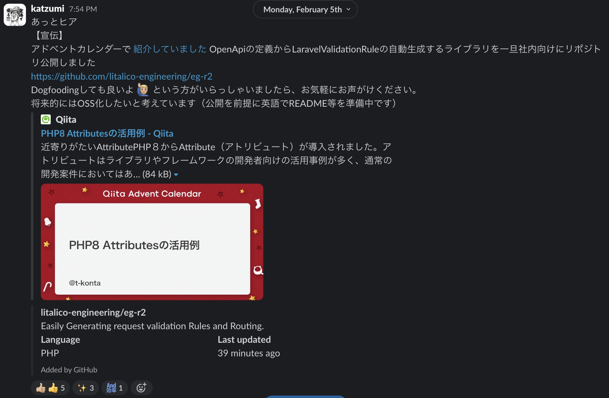

# 『eg-r2』の公開について

LITALICO SaaS Summit_2411　Nov 15, 2024.  
v0.0.1  
@katzumi(かつみ)

<div class="pt-12">
  <span @click="$slidev.nav.next" class="px-2 py-1 rounded cursor-pointer" hover="bg-white bg-opacity-10">
    Press Space for next page <carbon:arrow-right class="inline"/>
  </span>
</div>

<div class="abs-br m-6 flex gap-2">
  <button @click="$slidev.nav.openInEditor()" title="Open in Editor" class="text-xl slidev-icon-btn opacity-50 !border-none !hover:text-white">
    <carbon:edit />
  </button>
  <a href="https://github.com/k2tzumi/eg-r2-launch" target="_blank" alt="GitHub" title="Open in GitHub"
    class="text-xl slidev-icon-btn opacity-50 !border-none !hover:text-white">
    <carbon-logo-github />
  </a>
</div>

<!--
The last comment block of each slide will be treated as slide notes. It will be visible and editable in Presenter Mode along with the slide. [Read more in the docs](https://sli.dev/guide/syntax.html#notes)
-->

---
transition: fade-out
layout: two-cols-header
---

# 自己紹介

katzumi（かつみ）と申します。

「障害のない社会をつくる」をビジョンに掲げている「りたりこ」という会社に所属しています
<a href="https://litalico.co.jp/">

</a>

以下のアカウントで活動しています。

::left::

<div class="float-left">
  
<simple-icons-x /> <a href="https://twitter.com/katzchum">katzchum</a></div>  
<QRCode :width="180" :height="180" value="https://twitter.com/katzchum" color="4329B9" image="Logo_of_X.svg" />

::right::


<logos-github-octocat /> [k2tzumi](https://github.com/k2tzumi)  
<simple-icons-zenn /> [katzumi](https://zenn.dev/katzumi)  

<br />

<style>
h1 {
  background-color: #2B90B6;
  background-image: linear-gradient(45deg, #4EC5D4 10%, #146b8c 20%);
  background-size: 100%;
  -webkit-background-clip: text;
  -moz-background-clip: text;
  -webkit-text-fill-color: transparent;
  -moz-text-fill-color: transparent;
}
</style>

---
layout: default
transition: fade-out
---

# eg-r2 プレリリース
法改正リリース後に社内のみ先行公開していました

<Transform :scale="0.6">  
  
</Transform>

---
layout: statement
---

# 祝！オープンソース化！ 🎉
たぶん LITALICO 初

---
layout: default
transition: slide-up
---

# packagistにも公開されています
https://packagist.org/packages/litalico-engineering/eg-r2

`composer require litalico-engineering/eg-r2` で直ぐに使えます。

---

# eg-r2 とは？
Easy request validation and route generation from open API specifications

2 つのことを簡単(Easy)にすることを目的としています

<v-clicks>

1. リクエストバリデーション
2. ルート生成

</v-clicks>

---
transition: slide-up
---

# 前提
require

* PHP8.2 以上  
PHP Attributes で API Spec を記述する為
* Laravel9.0 以上
最新バージョン(version1.0.0)以降は 11.0 以上
* [swagger-php](https://zircote.github.io/swagger-php/)で API 仕様書を OpenAPI V3 形式で記述

---

# リクエストのバリデーション自動生成
Easy request validation

OpenAPI でスキーマ定義しておけば、バリデーションが自動生成されます！

---
transition: view-transition
---

# As-is
こんな感じで FormRequest のクラス定義していますよね？

<span v-mark.circle.red="1">別途 API 仕様書を記述する必要</span>があります

```php
/**
 * @property int $age
 * @property string $name
 * @property bool $is_active
 */
class MyFormRequest extends FormRequest
{
  public function rules()
  {
    return [
      'age' => 'required|integer',
      'name' => 'required|string',
      'is_active' => 'required|boolean',
    ];
  }
}
```

---
transition: slide-up
---

# To-be
こんな感じで FormRequest に OpenAPI を Spec を Attribute を記述するだけ！

Trait を追加するだけ！<span v-mark.circle.red="1">その他の記述不要</span>  

```php
#[Schema(title: 'My request', required:['age', 'name', 'is_active'])]
class MyFormRequest extends FormRequest
{
  use RequestRuleGeneratorTrait, FormRequestPropertyHandlerTrait;  

  #[Property(property: 'age', type: 'integer', format: 'int64')]
  public int $age;

  #[Property(property: 'name', type: 'string')]
  public string $name;

  #[Property(property: 'is_active', type: 'boolean')]
  public boolean $is_active;

  // roulesメソッドはtraitで自動生成しているので不要
}
```

リクエストパラメータを型安全に扱えます！

---

# 何が嬉しいのか？
eg-r2 の狙い

* API 仕様書と実装の乖離を発生させない！
* 手数が減り気になりポイントも減る  
全体の記述量も減るのでは？

---
transition: fade
---

# ルーティング生成の自動化
Easy route generation

コマンド一発でルーティングの自動生成  
`php artisan eg-r2:generate-route`  

<Transform :scale="0.7">  

  ```php
  /**
  * This file is auto-generated.
  */

  declare(strict_types=1);

  Route::as('api')->group(static function (): void {
      Route::controller('App\Http\Controllers\Pet')->group(static function (): void {
          Route::post('/pet', 'addPet');
          Route::put('/pet', 'updatePet');
          Route::get('/pet/findByStatus', 'findPetsByStatus');
          Route::post('/pet/{petId}', 'updatePetWithForm');
          Route::delete('/pet/{petId}', 'deletePet');
          Route::post('/pet/{petId}/uploadImage', 'uploadFile');
      });
      Route::controller('App\Http\Controllers\Store')->group(static function (): void {
          Route::get('/store', 'getInventory');
          Route::post('/store/order', 'placeOrder');
          Route::get('/store/order/{orderId}', 'getOrderById');
          Route::delete('/store/order/{orderId}', 'deleteOrder');
      });
  });
  ```

</Transform>


---

# なぜ eg-r2 を作ったのか？
全ては法改正に爆速で対応するシステムを作る為

* API 仕様書の品質を高めるため！  
API 仕様書の品質が悪いと手戻りが発生してしまう  
API 仕様の見直しで実装との乖離を発生させない
* API 仕様書を先に公開して実装するため  
各プロダクトと並行で開発する[^1]

[^1]: スキーマ駆動開発といいます

---

# どうなったか？
eg-r2 の効果

多数の API を高品質且つ爆速で構築
* 法改正を乗り越えることができました
* 200 弱の API が eg-r2 によって作成
* 1 つの API で 100 弱のパラメータが存在 
* 法改正時に 80 の API 追加

---
transition: slide-up
---

# なぜ eg-r2 をオープンソース化したのか？
OSS 化の狙い

* 様々なユースケースに対応させるため  
他のプロジェクトでも利用可能なように機能追加をしていきたい
* フィードバックサイクルを回すため  
スキーマ駆動開発の在り方をディスカッションしたい為  
スキーマが先か？コードが先か？の問題を提起したい

---

# 今後について
eg-r2 の発展について

* 対応ユースケースの拡大  
ドックフーディングしてくれる方募集中です
* 社内外での発表して認知拡大

---
transition: fade
---

# 最後に
絶賛募集中です

We're contributing.

---

# Link

* [eg-r2](https://github.com/litalico-engineering/eg-r2)  
プロジェクトリポジトリ
* [eg-r2-example](https://github.com/k2tzumi/eg-r2-example)  
サンプルリポジトリ
* [頑張らないスキーマ駆動開発を支える『eg-r2』を公開しました](https://zenn.dev/litalico/articles/what-is-eg-r2)

---
layout: end
---

ご清聴ありがとうございました